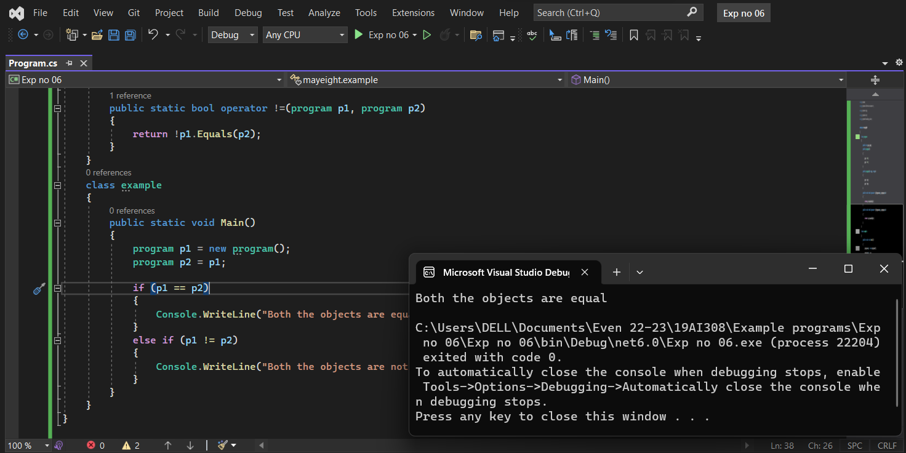

# OPERATOR-OVERLOADING

## AIM:
 To write a C# program to pass values through constructors(default and parameterized) and also overload equal operators by checking whether objects are equal using operator overloading. 
 
## ALGORITHM:
### Step 1:
Create a class for operator overloading.

### Step 2:
Values are passed through constructors.

### Step 3:
After that return the bool operator.

### Step 4:
Then create a new object to store the return object.

### Step 5:
After that print the calculated volume.

 ## PROGRAM:
 Developed by : Shrruthilaya G

 Register number : 212221230097
 ```
 using System;
using System.Collections.Generic;
using System.Linq;
using System.Text;
using System.Threading.Tasks;

namespace mayeight
{
    class program
    {
        public int pp1, pp2;
        public program()
        {
            pp1 = 50;
            pp2 = 10;
        }
        public program(int p3, int p4)
        {
            pp1 = p3;
            pp2 = p4;
        }
        public static bool operator ==(program p1, program p2)
        {
            return p1.Equals(p2);
        }
        public static bool operator !=(program p1, program p2)
        {
            return !p1.Equals(p2);
        }
    }
    class example
    {
        public static void Main()
        {
            program p1 = new program();
            program p2 = p1;

            if (p1 == p2)
            {
                Console.WriteLine("Both the objects are equal");
            }
            else if (p1 != p2)
            {
                Console.WriteLine("Both the objects are not equal");
            }
        }
    }
}
```
 
## OUTPUT:

 
 
## RESULT:
Thus a C# program to pass values through constructors(default and parameterized) and also overload equal operators by checking whether objects are equal using operator overloading is successfully executed.